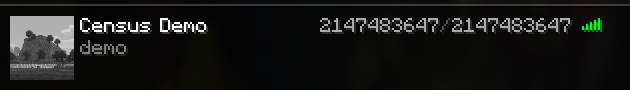
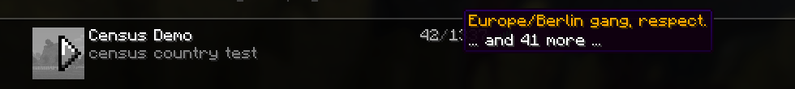
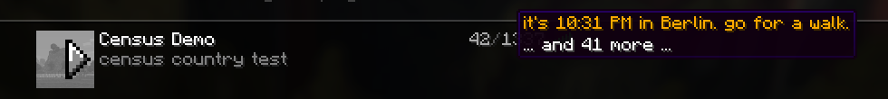

# Census

A tiny server list plugin. When someone hovers the player count on your server
list, Census shows a rotating message instead of the usual player names.

Works on Velocity and Paper.

## Screenshots

Default lines:


With `fake-online` and `fake-max` set:



With geolocation on (country, ISP, distance and time placeholders):





## Installation

Drop the jar in your `plugins` folder and restart. That's it, it works out of
the box with the default lines.

- `Census-1.0.0.jar` for Velocity (the proxy owns the server list, so put it there)
- `Census-Paper-1.0.0.jar` for Paper

## Config

`config.yml` is small on purpose:

- `enabled` turn it off without deleting the plugin
- `mode` sequential, random, or static (static is always the first line)
- `fake-online` / `fake-max` pretend player numbers, -1 keeps the real ones
- `hide-players` hide the count and the hover completely
- `server-host` your public address, used by `%server_city%` and `%distance%`
- `geoip-enabled` optional geolocation, see below

Edit `messages.yml` to change the lines. It reloads on the next ping, no restart
needed.

## Messages

Lines are written in MiniMessage, and Census converts them to the old style
colour codes for the server list (bold/italic are supported)

```yaml
messages:
  - "<gold>hovering is free, joining is also free</gold>"
  - "<gold>you can stop inspecting the player count now</gold>"
```

Add as many as you like, they rotate. You can also add `morning`, `afternoon`,
`evening` and `night` lists, which get mixed in based on each player's local
time.

Placeholders:

```
%country% %country_code% %city% %db_city% %region% %timezone% %local_time%
%distance% %asn% %isp% %server_city% %server_country%
```

Any line that uses a placeholder Census can't fill gets skipped, so a raw
`%thing%` never shows up on the client.

## Geolocation (optional)

Off by default. To turn it on, grab the two free DB-IP lite databases:

- `geoip-city.mmdb` from https://db-ip.com/db/download/ip-to-city-lite
- `geoip-asn.mmdb` from https://db-ip.com/db/download/ip-to-asn-lite

Unzip the `.mmdb` out of each archive, drop them next to `config.yml`, set
`geoip-enabled: true` and restart. IP data by DB-IP (https://db-ip.com).
